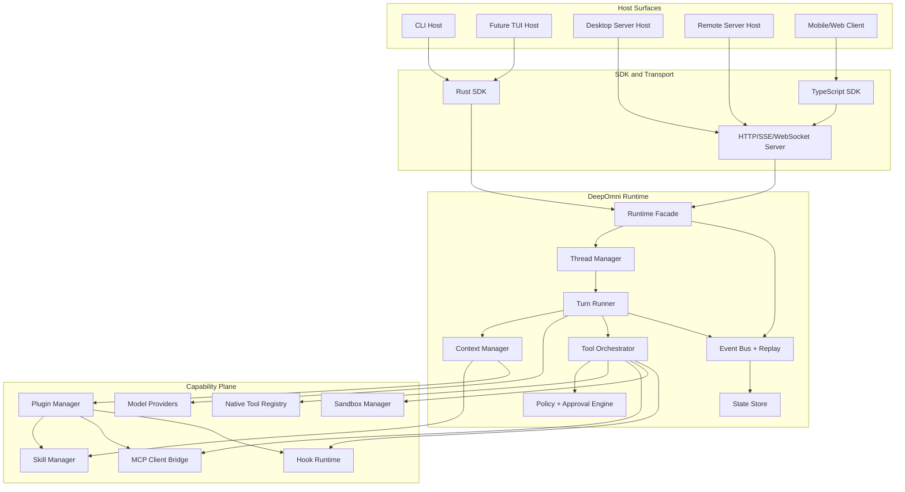
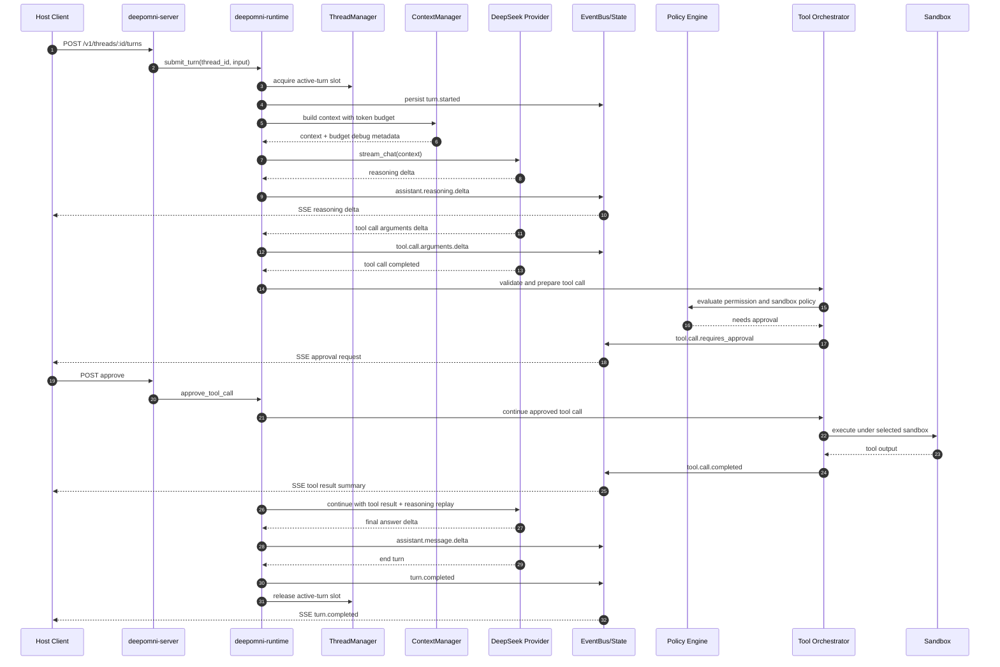

# DeepOmni Runtime PRD and Technical Design

Date: 2026-05-10
Status: Draft for review
Owner: DeepOmni

## 1. Product Intent

DeepOmni is a DeepSeek-native agent runtime for production coding agents. The first version is not a CLI-first product. It is a Rust core runtime that can be embedded into a CLI, TUI, desktop server, remote server, worker process, mobile-controlled session, or future IDE client.

The product should feel like Codex in execution style: local-first, workspace-aware, event-driven, approval-gated, sandboxed, and suitable for SDK/server embedding. It should approach Claude Code in capability surface: rich tools, skills, plugins, commands, hooks, MCP, sub-agents, and eventually computer use. It should reuse DeepSeek-TUI's DeepSeek-native runtime ideas: OpenAI-compatible DeepSeek streaming, long-context workflow, HTTP/SSE runtime API, durable tasks, TUI separation, sandboxing, and stateful sessions.

DeepOmni's durable asset is the runtime protocol and Rust crate graph. UI clients are hosts over the same runtime.

## 2. Goals

- Provide a production-grade Rust agent runtime core.
- Expose a stable SDK and service contract for local and remote hosts.
- Support DeepSeek as a first-class model provider while preserving a provider registry for OpenAI-compatible, Ollama, vLLM, SGLang, and enterprise gateways.
- Support thread, turn, event, tool, approval, sandbox, plugin, skill, and MCP primitives from the first version.
- Keep the runtime independent from CLI/TUI/Desktop UI.
- Maximize reuse of the reference projects under `ref/` through design reuse, targeted source adaptation, and compatibility-inspired APIs.
- Establish a crate-level architecture that can scale to production testing, remote execution, computer use, and enterprise deployments.

## 3. Non-Goals for V1

- Full marketplace distribution.
- Full terminal TUI parity with Codex or Claude Code.
- Full computer use implementation.
- Full IDE integration.
- Full mobile app.
- Multi-tenant hosted SaaS control plane.
- Complex remote worker fleet scheduling.

V1 must still reserve stable boundaries for these later capabilities.

## 4. Reference Reuse Strategy

DeepOmni should not copy an entire upstream project wholesale. It should reuse designs and selectively adapt code where licensing and engineering fit are clear.

### 4.1 Codex Reference

Source: `ref/codex`

Reuse targets:

- Thread/session/turn concepts from `codex-rs/core/src/thread_manager.rs` and `codex-rs/core/src/codex_thread.rs`.
- Tool trait, registry, routing, diff streaming, and mutating-tool classification from `codex-rs/core/src/tools/registry.rs`.
- Approval, sandbox selection, retry, hooks, network policy, and tool orchestration ideas from `codex-rs/core/src/tools/orchestrator.rs`.
- Plugin manifest shape from `codex-rs/core-plugins/src/manifest.rs`.
- Plugin identity and capability summaries from `codex-rs/plugin/src/lib.rs`.
- Skills manager and injection concepts from `codex-rs/core-skills` and `codex-rs/core/src/skills.rs`.
- MCP client/server architecture from `codex-rs/rmcp-client`, `codex-rs/codex-mcp`, and `codex-rs/mcp-server`.
- State and rollout concepts from `codex-rs/core/src/state` and related thread store crates.

Adaptation rule:

- Preserve architectural concepts, event-driven shape, and safety boundaries.
- Rename and simplify protocol types for DeepOmni.
- Avoid coupling to OpenAI Responses-only assumptions.
- Keep DeepSeek Chat Completions streaming as a first-class path.

### 4.2 Claude Code Sourcemap Reference

Source: `ref/claude-code-sourcemap`

Reuse targets:

- Capability taxonomy: tools, commands, services, plugins, skills, remote sessions.
- UX and lifecycle concepts: slash commands, project commands, hooks, memory, MCP, agents, remote session manager.
- Plugin/skill/product affordances, not source-level copying.

Adaptation rule:

- Treat as a behavioral and product reference only.
- Do not rely on internal or reconstructed source structure as a production dependency.

### 4.3 DeepSeek-TUI Reference

Source: `ref/DeepSeek-TUI`

Reuse targets:

- DeepSeek provider defaults and OpenAI-compatible Chat Completions streaming.
- Runtime API concepts from `docs/RUNTIME_API.md`.
- High-level runtime architecture from `docs/ARCHITECTURE.md`.
- Durable thread/turn/event API.
- HTTP/SSE server shape.
- Task manager and background queue concepts.
- LSP post-edit diagnostics concept.
- Sandbox, hooks, skills, tools, plugins, and MCP boundary.

Adaptation rule:

- Prefer DeepSeek-TUI semantics for DeepSeek provider behavior.
- Rebuild the crate graph around a cleaner production SDK boundary.
- Use DeepSeek-TUI as the strongest reference for local server API and DeepSeek-native features.

## 5. Product Requirements

### 5.1 Runtime Core

The runtime must manage:

- Agent lifecycle.
- Thread lifecycle.
- Turn execution.
- Context assembly.
- Model streaming.
- Tool call loop.
- Approval requests.
- Sandbox selection.
- Event emission.
- Persistent state.
- Interruption and resume.

The runtime must not depend on a specific UI host.

### 5.2 SDK Embedding

DeepOmni must expose:

- Rust API for in-process embedding.
- HTTP/SSE API for local and remote hosts.
- TypeScript SDK for app/server/client integration.

Primary embedding modes:

- CLI host.
- Desktop app server.
- Remote server.
- Remote worker.
- Mobile-controlled client session.
- Future IDE host.

### 5.3 Tool System

V1 built-in tools:

- `read_file`
- `write_file`
- `edit_file`
- `apply_patch`
- `grep`
- `list_files`
- `shell_exec`
- `git_status`
- `git_diff`
- `git_apply`
- `todo_update`

Tool requirements:

- Every tool has a typed schema.
- Every tool declares mutability, sandbox needs, network needs, and approval default.
- Every tool emits structured lifecycle events.
- Every tool output can be truncated, summarized, or spilled to disk.
- Mutating tools always pass through the policy/orchestrator layer.

### 5.4 Skills

Skills are prompt-time behavior modules. A skill can include:

- `SKILL.md`
- supporting scripts
- assets
- templates
- metadata

Skills can be loaded from:

- Global user directory.
- Workspace `.deepomni/skills`.
- Plugin skills directory.
- Future remote marketplace cache.

Skills are not tools. They guide how the agent uses tools.

### 5.5 Plugins

Plugins are installable capability packages. A plugin can contribute:

- Skills.
- Tools.
- MCP server definitions.
- App connectors.
- Hooks.
- Slash commands.
- Auth providers.
- Native sidecars.
- Interface metadata.
- Permission requirements.

V1 plugin manager must support:

- Local plugin discovery.
- Manifest parsing.
- Enable/disable state.
- Capability listing.
- Permission declaration.
- Plugin-scoped data directory.

V1 can postpone remote marketplace install/update.

### 5.6 MCP

V1 must support MCP clients for external tool servers:

- stdio transport first.
- HTTP/SSE transport later.
- Tool discovery.
- Tool schema conversion.
- Approval and policy integration.

MCP tools must be indistinguishable from native tools at the agent loop boundary.

### 5.7 Computer Use

Computer Use is a future high-privilege plugin, not a core runtime feature.

Core V1 must reserve:

- Permission types: `screen.capture`, `input.control`, `window.inspect`, `clipboard.read`, `clipboard.write`.
- Tool classes: screenshot, click, type, keypress, scroll, drag, observe.
- Runtime adapter boundary for local macOS, Windows, Linux, remote browser, and remote desktop.
- Approval and redaction hooks for sensitive UI operations.

### 5.8 State and Persistence

The runtime must persist:

- Threads.
- Turns.
- Events.
- Tool calls.
- Usage.
- Approval decisions.
- Plugin state.
- Skill/plugin capability cache.
- Optional workspace snapshots.

V1 can use SQLite for structured state and filesystem blobs for large artifacts.

### 5.9 Security

Security requirements:

- Localhost-only server by default.
- Optional bearer token for HTTP/SSE API.
- Mutating tool approval in normal agent mode.
- YOLO/trusted mode must be explicit.
- Sandbox policy must be represented in the runtime protocol.
- Plugin permissions must be declared and visible.
- MCP tools must not bypass the policy engine.
- Computer Use must be disabled by default.

## 6. Runtime Architecture

```text
Hosts
├── deepomni-cli
├── deepomni-tui
├── desktop app
├── remote server
├── worker
└── mobile/web client
        │
        ▼
deepomni-server / deepomni-sdk
        │
        ▼
deepomni-runtime
├── agent loop
├── thread manager
├── turn runner
├── context manager
├── tool orchestrator
├── policy engine
├── event bus
└── state service
        │
        ├── model providers
        ├── tools
        ├── skills
        ├── plugins
        ├── hooks
        ├── MCP
        └── sandbox
```

Primary runtime architecture:



## 7. Crate Design

The workspace should be split into small crates with clear ownership. Crates should avoid circular dependencies. Protocol crates should not depend on runtime implementation crates.

### 7.1 Workspace Layout

```text
crates/
├── deepomni-core
├── deepomni-protocol
├── deepomni-config
├── deepomni-runtime
├── deepomni-agent
├── deepomni-model-provider
├── deepomni-provider-deepseek
├── deepomni-tools
├── deepomni-tool-builtin
├── deepomni-policy
├── deepomni-sandbox
├── deepomni-state
├── deepomni-events
├── deepomni-context
├── deepomni-skills
├── deepomni-plugin
├── deepomni-mcp
├── deepomni-hooks
├── deepomni-server
├── deepomni-task
├── deepomni-computer-use
├── deepomni-cli
└── deepomni-test-support
sdk/
└── typescript
```

Crate dependency layers:

```mermaid
flowchart TB
    subgraph L0["Layer 0: Foundation"]
        Core["deepomni-core\nError, Result, redaction"]
        Protocol["deepomni-protocol\nWire DTOs and schemas"]
    end

    subgraph L1["Layer 1: Configuration and Utilities"]
        Config["deepomni-config"]
        Events["deepomni-events"]
        State["deepomni-state"]
        TestSupport["deepomni-test-support"]
    end

    subgraph L2["Layer 2: Domain Capabilities"]
        Model["deepomni-model-provider"]
        DeepSeek["deepomni-provider-deepseek"]
        Tools["deepomni-tools"]
        Builtin["deepomni-tool-builtin"]
        Policy["deepomni-policy"]
        Sandbox["deepomni-sandbox"]
        Context["deepomni-context"]
        Skills["deepomni-skills"]
        Plugin["deepomni-plugin"]
        MCP["deepomni-mcp"]
        Hooks["deepomni-hooks"]
    end

    subgraph L3["Layer 3: Orchestration"]
        Agent["deepomni-agent"]
        Runtime["deepomni-runtime"]
        Task["deepomni-task"]
        Computer["deepomni-computer-use"]
    end

    subgraph L4["Layer 4: Hosts and SDK"]
        Server["deepomni-server"]
        CLI["deepomni-cli"]
        TSSDK["sdk/typescript"]
    end

    Config --> Core
    Config --> Protocol
    Events --> Core
    Events --> Protocol
    State --> Core
    State --> Protocol
    Model --> Core
    Model --> Protocol
    DeepSeek --> Model
    DeepSeek --> Core
    DeepSeek --> Protocol
    Tools --> Core
    Tools --> Protocol
    Policy --> Core
    Policy --> Protocol
    Sandbox --> Core
    Builtin --> Tools
    Builtin --> Policy
    Builtin --> Sandbox
    Context --> Core
    Context --> Protocol
    Context --> Skills
    Context --> Plugin
    Skills --> Core
    Skills --> Protocol
    Plugin --> Core
    Plugin --> Protocol
    MCP --> Core
    MCP --> Protocol
    MCP --> Tools
    Hooks --> Core
    Hooks --> Protocol
    Hooks --> Tools
    Agent --> Core
    Agent --> Protocol
    Agent --> Model
    Agent --> Tools
    Agent --> Policy
    Agent --> Events
    Agent --> Context
    Runtime --> Core
    Runtime --> Protocol
    Runtime --> Config
    Runtime --> Agent
    Runtime --> State
    Runtime --> Events
    Runtime --> Plugin
    Runtime --> MCP
    Runtime --> Hooks
    Task --> Runtime
    Computer --> Tools
    Computer --> Policy
    Server --> Runtime
    Server --> Config
    Server --> Protocol
    CLI --> Runtime
    CLI --> Config
    CLI --> Protocol
    TSSDK --> Protocol
```



Dependency rules:

- Diagram arrows point from consumer to dependency.
- Lower layers must not depend on higher layers.
- `deepomni-protocol` remains wire-compatible and implementation-free.
- `deepomni-core` remains a small foundation crate, not the agent runtime.
- `deepomni-config` may depend on protocol/core, but protocol/core must not depend on config.
- Host crates must not be depended on by runtime/domain crates.

### 7.2 `deepomni-protocol`

Purpose:

- Stable API and wire types.

Contains:

- `ThreadId`, `TurnId`, `EventSeq`, `ToolCallId`.
- Thread, turn, event models.
- Request/response DTOs.
- Tool schema types.
- Approval request/decision types.
- Permission profile types.
- Sandbox policy types.
- Usage and cost types.
- Error models.

Dependencies:

- `serde`
- `schemars`
- `thiserror`
- `time`
- `uuid`

Must not depend on runtime, server, tools, or provider crates.

Testing:

- JSON compatibility snapshot tests.
- Schema generation tests.
- Backward compatibility tests for event payloads.

### 7.3 `deepomni-runtime`

Purpose:

- Main host-agnostic runtime facade.

Contains:

- `Runtime`.
- `RuntimeBuilder`.
- `RuntimeConfig`.
- lifecycle start/shutdown.
- thread creation/resume/fork.
- turn submission.
- approval submission.
- interruption.
- event subscription.

Dependencies:

- `deepomni-protocol`
- `deepomni-agent`
- `deepomni-state`
- `deepomni-events`
- `deepomni-policy`
- `deepomni-tools`
- `deepomni-plugin`
- `deepomni-skills`
- `deepomni-mcp`
- `deepomni-model-provider`

Testing:

- Runtime lifecycle integration tests.
- Resume/interruption tests.
- Concurrent thread tests.
- Host-agnostic API tests.

### 7.4 `deepomni-agent`

Purpose:

- Agent loop and turn runner.

Contains:

- `AgentLoop`.
- `TurnRunner`.
- model streaming parser.
- DeepSeek reasoning stream handling.
- tool call detection.
- tool result continuation.
- reasoning replay for tool-call continuation.
- context compaction trigger.
- sub-agent spawn/result boundary.

References:

- Codex thread/turn concepts.
- DeepSeek-TUI turn loop.

Testing:

- Mock provider turn-loop tests.
- Tool-call loop tests.
- Streaming delta parser tests.
- Interrupted turn tests.
- Context compaction trigger tests.

### 7.5 `deepomni-model-provider`

Purpose:

- Provider abstraction and registry.

Contains:

- `ModelProvider` trait.
- `ModelStream`.
- `ModelRequest`.
- `ModelEvent`.
- provider registry.
- model metadata and capability discovery.

Testing:

- Mock provider.
- Provider selection tests.
- Model capability tests.

### 7.6 `deepomni-provider-deepseek`

Purpose:

- DeepSeek-native provider implementation.

Contains:

- OpenAI-compatible Chat Completions client.
- streaming parser.
- tool call normalization.
- DeepSeek-specific headers and base URL config.
- optional beta endpoint support.
- token/cost metadata mapping.

References:

- DeepSeek-TUI client and provider behavior.

Testing:

- Fixture-based streaming parser tests.
- Request serialization tests.
- Error mapping tests.
- Retry and timeout tests.
- No live API dependency in default test suite.

### 7.7 `deepomni-tools`

Purpose:

- Tool traits, registry, router, output model.

Contains:

- `ToolHandler` trait.
- `ToolRegistry`.
- `ToolInvocation`.
- `ToolOutput`.
- `ToolSpec`.
- mutability classification.
- tool argument diff streaming.
- MCP/native unified tool wrapper.

References:

- Codex `ToolHandler`, registry, router, and output concepts.

Testing:

- Registry tests.
- Duplicate-name tests.
- Schema tests.
- Mutability classification tests.
- Tool output truncation tests.

### 7.8 `deepomni-tool-builtin`

Purpose:

- Production built-in tools.

Contains:

- file tools.
- shell tool.
- grep/list tools.
- apply patch.
- git tools.
- todo tools.

Dependencies:

- `deepomni-tools`
- `deepomni-policy`
- `deepomni-sandbox`

Testing:

- Temp workspace tests for every tool.
- Golden output tests.
- Permission and sandbox behavior tests.
- Cross-platform path tests.
- Apply-patch failure tests.

### 7.9 `deepomni-policy`

Purpose:

- Approval, permission, network, and execution policy decisions.

Contains:

- `ApprovalPolicy`.
- `PermissionProfile`.
- `PolicyDecision`.
- `NetworkPolicy`.
- approval cache.
- trusted/agent/plan modes.

References:

- Codex approval policy and tool orchestration semantics.

Testing:

- Policy matrix tests.
- Mutating vs read-only decisions.
- Network approval tests.
- Trusted mode tests.
- Denied command tests.

### 7.10 `deepomni-sandbox`

Purpose:

- Platform sandbox abstraction.

Contains:

- `SandboxManager`.
- macOS Seatbelt adapter.
- Linux Landlock adapter.
- Windows placeholder adapter.
- no-sandbox adapter.
- sandbox denial classification.

References:

- Codex sandbox and DeepSeek-TUI sandbox architecture.

Testing:

- Unit tests for policy generation.
- Platform-gated integration tests.
- Denial classification tests.

### 7.11 `deepomni-state`

Purpose:

- Durable persistence.

Contains:

- SQLite store.
- thread store.
- turn store.
- event store.
- tool call store.
- plugin state store.
- migration system.
- blob/artifact store.

Testing:

- Migration tests from empty DB.
- Round-trip serialization tests.
- Event replay tests.
- Corruption/recovery tests.
- Concurrent read tests.

### 7.12 `deepomni-events`

Purpose:

- Runtime event bus and event replay.

Contains:

- monotonic event sequence.
- broadcast subscriptions.
- persisted event replay.
- SSE adapter helpers.
- event filters.

Testing:

- Ordering tests.
- Replay since sequence tests.
- Backpressure tests.
- Subscriber drop tests.

### 7.13 `deepomni-context`

Purpose:

- Context assembly and compaction.

Contains:

- system prompt fragments.
- project instructions.
- skills injection.
- plugin capability summaries.
- environment context.
- conversation history selection.
- compaction interface.

References:

- Codex context fragments and skill/plugin instruction renderers.

Testing:

- Prompt assembly golden tests.
- Skill injection tests.
- Plugin capability rendering tests.
- Token budget tests with mock tokenizer.

### 7.14 `deepomni-skills`

Purpose:

- Skill discovery, loading, rendering, and selection.

Contains:

- `Skill`.
- `SkillManager`.
- global/workspace/plugin skill roots.
- mention syntax.
- metadata parser.
- asset/script path resolution.

Testing:

- Directory discovery tests.
- Frontmatter parsing tests.
- Plugin skill namespace tests.
- Path traversal rejection tests.

### 7.15 `deepomni-plugin`

Purpose:

- Plugin manifest, install state, capability loading.

Contains:

- `PluginManifest`.
- `PluginManager`.
- local plugin discovery.
- enable/disable.
- capability summaries.
- permissions.
- plugin data root.

Manifest fields:

```json
{
  "id": "deepomni.example",
  "name": "Example",
  "version": "0.1.0",
  "description": "Example plugin",
  "skills": "./skills",
  "tools": "./tools.json",
  "mcpServers": "./mcp.json",
  "hooks": "./hooks.json",
  "commands": "./commands",
  "permissions": ["filesystem.read"],
  "runtime": {
    "type": "none"
  },
  "interface": {
    "displayName": "Example",
    "capabilities": ["example"]
  }
}
```

References:

- Codex plugin manifest and capability summary.

Testing:

- Manifest parsing tests.
- Relative path validation tests.
- Enable/disable state tests.
- Capability summary tests.
- Malformed manifest tests.

### 7.16 `deepomni-mcp`

Purpose:

- MCP client and native tool bridge.

Contains:

- stdio MCP client.
- server lifecycle.
- tool discovery.
- tool call bridge.
- MCP resource support later.

Testing:

- In-process fake MCP server tests.
- Discovery tests.
- Tool schema conversion tests.
- Server crash tests.

### 7.17 `deepomni-hooks`

Purpose:

- Lifecycle hooks.

Hook points:

- session start.
- user prompt submitted.
- before tool call.
- permission requested.
- after tool call.
- turn completed.
- session stop.

Testing:

- Hook matching tests.
- Hook timeout tests.
- Hook failure isolation tests.
- Context injection tests.

### 7.18 `deepomni-server`

Purpose:

- HTTP/SSE/WebSocket runtime API.

Contains:

- Axum server.
- authentication middleware.
- thread endpoints.
- turn endpoints.
- approval endpoints.
- event SSE endpoint.
- health and introspection endpoints.

Endpoints:

```text
GET  /health
POST /v1/threads
GET  /v1/threads
GET  /v1/threads/:id
PATCH /v1/threads/:id
POST /v1/threads/:id/resume
POST /v1/threads/:id/fork
POST /v1/threads/:id/turns
POST /v1/threads/:id/turns/:turn_id/approve
POST /v1/threads/:id/turns/:turn_id/reject
POST /v1/threads/:id/turns/:turn_id/interrupt
GET  /v1/threads/:id/events?since_seq=0
GET  /v1/tools
GET  /v1/skills
GET  /v1/plugins
PATCH /v1/plugins/:id
GET  /v1/mcp/servers
GET  /v1/mcp/tools
```

Testing:

- API integration tests.
- SSE replay tests.
- Auth tests.
- Cancellation tests.
- Concurrent clients tests.

### 7.19 `deepomni-task`

Purpose:

- Durable background task queue.

V1 status:

- Skeleton crate with protocol integration.
- Full implementation can land after runtime MVP.

Contains later:

- task queue.
- worker pool.
- task timelines.
- task artifacts.
- scheduled automation hook.

References:

- DeepSeek-TUI durable task manager.

### 7.20 `deepomni-computer-use`

Purpose:

- Future high-privilege plugin/tool adapter crate.

V1 status:

- Protocol and permission definitions only.
- No default runtime activation.

Contains later:

- screenshot.
- click.
- type.
- keypress.
- scroll.
- drag.
- observe.
- platform adapters.

Testing later:

- Mock desktop adapter tests.
- Screenshot redaction tests.
- Approval tests.
- Remote browser adapter tests.

### 7.21 `deepomni-cli`

Purpose:

- Minimal debug host for runtime.

V1 commands:

```text
deepomni run
deepomni serve
deepomni doctor
deepomni plugin list
deepomni skill list
```

The CLI must remain thin. It should not own runtime logic.

### 7.22 `deepomni-test-support`

Purpose:

- Shared test fixtures and fakes.

Contains:

- mock model provider.
- fake streaming fixtures.
- temp workspace helpers.
- fake MCP server.
- fake tool handlers.
- event assertions.
- snapshot helpers.

## 8. Agent Loop

The turn runner follows this sequence:

1. Receive user input.
2. Persist turn start.
3. Build the capability snapshot for this turn.
4. Assemble context under the token budget.
5. Send request to provider.
6. Stream assistant message deltas and reasoning deltas as separate event classes.
7. Persist complete reasoning blocks when the provider emits them.
8. Detect tool calls.
9. Validate tool arguments against the tool schema.
10. For each tool call, route through tool orchestrator.
11. Request approval if policy requires it.
12. Execute under selected sandbox.
13. Persist tool result and emit events.
14. Continue model turn with tool results.
15. For DeepSeek thinking mode, replay the assistant reasoning content required by the provider when continuing after tool calls.
16. Complete turn or compact context if needed.

All externally visible state changes emit events.

Reasoning replay is a P0 requirement for DeepSeek compatibility. If an assistant message contains tool calls and provider reasoning content, the continuation request must include the complete reasoning content in the provider-specific shape required by DeepSeek. The protocol exposes reasoning as structured runtime events, but the provider adapter owns the exact request serialization.

## 9. Runtime Event Protocol

Core events:

```text
thread.created
thread.updated
thread.archived
turn.started
turn.steered
turn.interrupted
assistant.message.delta
assistant.message.completed
assistant.reasoning.delta
assistant.reasoning.completed
tool.call.started
tool.call.arguments.delta
tool.call.requires_approval
tool.call.approved
tool.call.rejected
tool.call.completed
tool.call.failed
context.compaction.started
context.compaction.completed
subagent.spawned
subagent.completed
subagent.failed
turn.completed
turn.failed
runtime.warning
```

Events must be:

- Ordered per thread.
- Persisted before delivery where possible.
- Replayable by `since_seq`.
- JSON schema documented.
- Stable across hosts.
- Able to distinguish final answer text from reasoning text.
- Able to replay provider-required reasoning content during tool-call continuation without exposing hidden provider internals to hosts that do not render reasoning.

## 10. SDK API

### 10.1 Rust SDK

Example:

```rust
let runtime = RuntimeBuilder::new()
    .workspace("/repo")
    .provider(deepseek_provider)
    .build()
    .await?;

let thread = runtime.create_thread(CreateThreadRequest {
    workspace: "/repo".into(),
    model: Some("deepseek-chat".into()),
    ..Default::default()
}).await?;

let mut events = runtime.subscribe(thread.id).await?;
runtime.submit_turn(thread.id, "Fix the failing tests").await?;
```

### 10.2 TypeScript SDK

Example:

```ts
const client = new DeepOmniClient({ baseUrl: "http://127.0.0.1:7878" });

const thread = await client.threads.create({
  workspace: "/repo",
  model: "deepseek-chat",
});

for await (const event of client.threads.run(thread.id, {
  input: "Fix the failing tests",
})) {
  console.log(event);
}
```

## 11. Test Strategy

DeepOmni is production-targeted. Every crate must have meaningful tests before it is considered complete.

### 11.1 Coverage Targets

- Protocol crates: 90%+ line coverage.
- Policy, tools, state, provider parser: 85%+ line coverage.
- Runtime and server: integration coverage over all critical flows.
- CLI: smoke coverage.

Coverage percentage is not enough. Critical behavior must have scenario tests.

### 11.2 Test Classes

Unit tests:

- Protocol serialization.
- Tool schema validation.
- Policy matrix.
- Provider streaming parser.
- Manifest parsing.
- Context rendering.

Integration tests:

- Full turn with mock model and built-in tool.
- Approval required and approved.
- Approval rejected.
- Tool failure returned to model.
- Interrupt mid-turn.
- Resume thread from state.
- SSE replay.
- MCP fake server tool call.
- Parent spawns child sub-agent, child completes, and parent receives structured result.
- Parent cancels child sub-agent mid-execution.
- Child failure surfaces correctly in the parent event stream.

Golden tests:

- Prompt/context rendering.
- Event JSON.
- Plugin manifest parsing.
- Tool outputs.

Property tests:

- Event sequence monotonicity.
- Path normalization.
- Manifest path validation.

Platform tests:

- macOS sandbox when available.
- Linux sandbox when available.
- Windows no-op or placeholder behavior.

Manual/live tests:

- DeepSeek live provider smoke test behind an ignored test flag.
- Computer use live tests later, disabled by default.

### 11.3 CI Gates

Minimum CI commands:

```bash
cargo fmt --all -- --check
cargo clippy --workspace --all-targets -- -D warnings
cargo test --workspace
cargo test --workspace --features integration
```

Optional later:

```bash
cargo llvm-cov --workspace --fail-under-lines 80
```

## 12. Production Readiness Requirements

Before a runtime milestone is called production-ready:

- All crates compile with warnings denied.
- Critical flows have integration tests.
- Runtime API has schema docs.
- Event protocol has compatibility tests.
- State migrations are tested.
- No mutating tool bypasses policy.
- Plugin permissions are visible before enablement.
- Server auth works for non-local exposure.
- Logs do not leak API keys.
- Tool output truncation prevents unbounded memory growth.
- Cancellation works for long-running turns/tools.

## 13. Milestones

### Milestone 0: Workspace and Protocol

- Create Rust workspace.
- Add protocol crate.
- Add event models.
- Add basic state schema.
- Add test-support crate.

Exit criteria:

- Protocol schema tests pass.
- Example event JSON snapshots pass.

### Milestone 1: Runtime MVP

- Runtime builder.
- Thread manager.
- Turn runner.
- Mock provider.
- Event bus.
- SQLite persistence.

Exit criteria:

- Mock full-turn integration test passes.
- Resume thread test passes.

### Milestone 2: DeepSeek Provider and Built-in Tools

- DeepSeek provider.
- File/shell/grep/apply_patch/git tools.
- Tool orchestrator.
- Approval policy.

Exit criteria:

- Tool-call loop with mock provider passes.
- DeepSeek live smoke test is available behind ignored flag.

### Milestone 3: Server and SDK

- HTTP server.
- SSE events.
- approval endpoints.
- TS SDK.
- minimal CLI.

Exit criteria:

- SDK can create thread, run turn, stream events, and approve tool call.

### Milestone 4: Skills, Plugins, MCP

- Skill manager.
- Plugin manager.
- Manifest loader.
- MCP stdio client.
- Hook runtime.

Exit criteria:

- Local plugin can add a skill and MCP tool.
- Plugin enable/disable updates runtime capabilities.

### Milestone 5: Remote and Computer Use Foundations

- Remote worker protocol draft.
- Durable task skeleton.
- Computer Use permission and tool protocol.
- Local adapter abstraction.

Exit criteria:

- Computer Use plugin can be discovered but remains disabled by default.
- Remote executor protocol has documented test fixtures.

## 14. Decision Register

Settled recommendations:

- Use Rust core for V1.
- Use SQLite as the primary state store, with optional event JSONL export later.
- Use JSON plugin manifests first for Codex compatibility.
- Use DeepSeek-TUI-style HTTP/SSE endpoint shape.
- Use Codex-style tool orchestration and plugin manifest concepts.
- Keep Computer Use as a plugin boundary from day one.
- Build test support first so runtime behavior can be developed with deterministic mock providers.

Open decisions are tracked in §22 so the document has one active list of unresolved architecture questions.

## 15. Review Addendum: Product Scenarios and Production Architecture

This section addresses the first detailed design review. It tightens the PRD around user stories, execution priority, concurrency safety, error boundaries, success metrics, and plugin/skill flow.

### 15.1 Core User Stories

User stories are the reason the runtime boundaries exist. V1 should be validated against these scenarios before implementation details are considered stable.

#### Story 1: SDK Developer Embeds a Local Agent

As a CLI or desktop developer, I want to embed DeepOmni Runtime with a small Rust or TypeScript API so that my product can run a DeepSeek coding agent without reimplementing thread state, tool orchestration, approvals, or streaming.

Acceptance criteria:

- Developer can create a runtime with workspace, model, config, and permission profile.
- Developer can create a thread, submit a turn, stream events, and approve/reject tools.
- First token/delta event is observable through the same event protocol used by the server.
- No UI-specific dependency is required.

#### Story 2: Desktop App Runs a Local Server

As a desktop app, I want to launch `deepomni serve` on localhost and communicate through HTTP/SSE so that the UI can be rebuilt independently from the agent engine.

Acceptance criteria:

- App can call `/health`, create threads, start turns, and subscribe to events.
- App can show tool approval prompts from structured events.
- App can reconnect and replay missed events by `since_seq`.
- Localhost mode works without multi-user auth; optional bearer auth works when enabled.

#### Story 3: Mobile Client Controls a Remote Worker

As a mobile client, I want to connect to a remote DeepOmni server and steer a running agent so that long coding tasks can run on a server while I approve sensitive actions from the phone.

Acceptance criteria:

- Remote server exposes the same thread/turn/event protocol.
- Approval events include enough metadata for a small client to render decisions.
- Interrupt and steer operations work while a turn is active.
- Tool execution happens in the remote workspace, not on the mobile device.

#### Story 4: Plugin Developer Adds a Capability Pack

As a plugin developer, I want to package skills, MCP tools, hooks, commands, and permissions into a plugin so that users can install one capability instead of wiring many pieces manually.

Acceptance criteria:

- Runtime discovers a local plugin manifest.
- Runtime validates manifest paths and permission declarations.
- Plugin-contributed skills and MCP tools appear in introspection APIs.
- Disabling the plugin removes its capabilities from future turns.

#### Story 5: Operator Runs a Production Server

As an operator, I want predictable resource usage, audit-friendly events, and clear error classes so that DeepOmni can run unattended in a CI/server environment.

Acceptance criteria:

- Concurrent threads are bounded by configuration.
- Tool timeouts and output limits are enforced.
- State survives process restart.
- Errors are classified as user-visible, retryable, policy-denied, provider, tool, state, or internal.

## 16. Priority Model

The milestone list is ordered, but implementation work should be classified by priority so parallel work does not blur production criteria.

### 16.1 P0: Runtime Contract and Safety

P0 items block all later work:

- `deepomni-core` error/result foundation.
- `deepomni-protocol` wire types and event schemas.
- `deepomni-config` config loading and precedence.
- Runtime builder, thread manager, event bus, state store.
- Mock provider and deterministic agent-loop tests.
- DeepSeek reasoning event protocol and reasoning replay semantics.
- Context budget allocator with deterministic overflow behavior.
- Minimal sub-agent protocol: spawn/result, parent-child relation, permission inheritance.
- Approval/policy path for mutating tools.
- Basic HTTP/SSE server shape.

P0 exit criteria:

- One mock-provider turn streams events end to end.
- Reasoning deltas can be emitted, persisted, replayed, and included in provider continuation fixtures.
- Context assembly produces budget debug metadata and deterministic truncation decisions.
- Parent thread can spawn a child sub-agent and receive a structured result.
- One mutating tool requires approval and can be approved/rejected.
- State can replay thread events after restart.

### 16.2 P1: DeepSeek and Built-in Tools

P1 items make the runtime useful:

- DeepSeek provider.
- File, grep, shell, apply_patch, and git tools.
- Tool output truncation/spillover.
- Context assembly with project instructions.
- Context compaction strategy beyond deterministic truncation.
- Server approval endpoints.
- TypeScript SDK skeleton.

P1 exit criteria:

- SDK can run a DeepSeek-backed coding turn with a built-in tool.
- Built-in tools have temp-workspace integration tests.
- Provider parser has fixture tests for streaming deltas and tool calls.

### 16.3 P2: Extensions

P2 items make the platform extensible:

- Skill manager.
- Plugin manager.
- MCP stdio client.
- Hook runtime.
- Minimal CLI.
- Computer Use protocol placeholders.

P2 exit criteria:

- A local plugin can contribute a skill and MCP tool.
- Plugin enable/disable changes runtime capability introspection.
- Computer Use permissions exist but remain disabled by default.

### 16.4 Parallelization Guidance

Can run in parallel:

- `deepomni-protocol` and `deepomni-config`.
- `deepomni-state` and `deepomni-events` after protocol event types stabilize.
- Mock provider and built-in tool implementations after tool traits stabilize.
- Server and TS SDK after thread/turn APIs stabilize.

Must be sequential:

- Protocol before server and SDK.
- Error taxonomy before crate public APIs.
- Policy/orchestrator before mutating built-in tools.
- Plugin manifest before plugin-contributed skills/MCP.

## 17. Core and Config Crate Decision

### 17.1 Add `deepomni-core`

DeepOmni should add a small `deepomni-core` crate, but it must stay intentionally boring. It is a foundation crate, not an application core.

Purpose:

- Framework-level `DeepOmniError`.
- `Result<T>` alias.
- Error kind taxonomy.
- Retryability and user-visibility markers.
- Redaction helpers for secrets and paths.
- Shared time/ID helpers only if needed.

Allowed dependencies:

- `thiserror`
- `anyhow` only at application boundary if needed.
- `tracing`
- `time`
- `uuid`

Forbidden responsibilities:

- Agent loop.
- Tool registry.
- Config loading.
- State access.
- HTTP types.
- Provider logic.

Rationale:

- Codex has many small utility crates plus a large `core`; DeepSeek-TUI has a `core` crate but also splits `config`, `protocol`, and `state`.
- DeepOmni should avoid a large catch-all `core`. `deepomni-runtime` owns orchestration. `deepomni-core` owns only shared framework primitives.

### 17.2 Add `deepomni-config`

DeepOmni should add a first-class `deepomni-config` crate.

Purpose:

- Load global, workspace, environment, and CLI/server override config.
- Resolve model provider config.
- Resolve workspace and runtime paths.
- Resolve permission profiles.
- Resolve plugin, skill, MCP, and hook roots.
- Provide redacted config views for diagnostics.
- Emit config reload events later.

Config precedence:

```text
explicit runtime builder values
> CLI/server flags
> environment variables
> workspace .deepomni/config.toml
> user ~/.deepomni/config.toml
> built-in defaults
```

References:

- Codex `codex-rs/config`.
- DeepSeek-TUI `crates/config`.

Testing:

- Precedence matrix tests.
- Missing config tests.
- Redaction tests.
- Workspace override tests.
- Invalid model/provider tests.

### 17.3 Dependency Rule

Recommended dependency direction:

```text
deepomni-protocol  -> no runtime deps
deepomni-core      -> no runtime deps, no protocol dependency unless unavoidable
deepomni-config    -> protocol + core
runtime crates     -> protocol + core + config as needed
server/sdk hosts   -> protocol + runtime + config
```

If `deepomni-core` starts accumulating business logic, split that logic into a domain crate instead of expanding core.

## 18. Concurrency and Async Runtime Model

### 18.1 Runtime Choice

Use Tokio as the async runtime for V1.

Reasons:

- Axum, reqwest, tokio streams, subprocess management, and SSE integration are mature.
- Codex and DeepSeek-TUI both operate in async Rust ecosystems.
- Agent turns, provider streams, tool execution, and event broadcasting are naturally async.

### 18.2 Ownership Model

Top-level runtime state:

```text
Runtime
└── Arc<RuntimeInner>
    ├── ThreadManager
    ├── EventBus
    ├── StateStore
    ├── ToolRegistry
    ├── ProviderRegistry
    ├── PolicyEngine
    ├── PluginManager
    └── CancellationRegistry
```

Rules:

- Public handles are cheap clones around `Arc`.
- Long-running operations must be cancellation-aware.
- Tool handlers must be `Send + Sync + 'static`.
- Event payloads must be owned values, not borrowed references.
- Do not hold locks across `.await` unless the lock is an async lock and the critical section is intentionally small.

### 18.3 Thread and Turn Concurrency

Default model:

- Multiple threads can run concurrently.
- A single thread allows at most one active turn by default.
- Steer/interrupt can target an active turn.
- Future mode can allow multiple child/sub-agent turns under one parent thread, but they must have explicit parent/child relationships.

Controls:

- `max_concurrent_threads`.
- `max_concurrent_tool_calls_per_turn`.
- `max_concurrent_model_requests`.
- `max_concurrent_mcp_calls`.
- per-tool timeout.
- per-turn timeout.

### 18.4 Channel Design

Recommended primitives:

- `tokio::sync::broadcast` for live event subscribers.
- persisted event store for durable replay.
- `tokio::sync::mpsc` for internal operation queues.
- `tokio::sync::watch` for runtime shutdown and config reload signals.
- `CancellationToken` for turn/tool cancellation.

The event bus must not rely only on broadcast channels. Broadcast is best-effort for live subscribers; persisted events are the source of truth.

### 18.5 Lock Strategy

Recommended:

- `RwLock<HashMap<ThreadId, Arc<ThreadHandle>>>` for thread registry.
- Per-thread mutex for active turn state.
- State store uses its own database pool and transaction boundaries.
- Tool registry is immutable after runtime start or updated through copy-on-write snapshots.
- Plugin capability updates produce a new capability snapshot for future turns; active turns keep their existing snapshot.

Testing:

- `loom` tests for small synchronization primitives if custom concurrency logic appears.
- Stress tests with 10 concurrent mock threads.
- Event ordering tests under concurrent tool completion.
- Cancellation tests for provider stream and shell tool.

## 19. Error Handling Strategy

### 19.1 Error Taxonomy

`deepomni-core` should define:

```text
DeepOmniError
├── Config
├── Protocol
├── Provider
├── Tool
├── PolicyDenied
├── Sandbox
├── State
├── Plugin
├── Mcp
├── Timeout
├── Cancelled
├── RateLimited
├── InvalidModelOutput
└── Internal
```

Each error should carry:

- stable kind.
- user-safe message.
- optional developer detail.
- retryability.
- user visibility.
- redaction status.
- optional source error.

### 19.2 Boundary Rules

Provider boundary:

- Provider HTTP/API errors become `Provider`, `RateLimited`, or `Timeout`.
- Streaming parser failures become `InvalidModelOutput`.
- Raw provider payloads must be redacted before surfacing.

Tool boundary:

- Tool execution failures become `Tool`.
- Policy rejection is not a tool failure; it is `PolicyDenied`.
- Sandbox denial becomes `Sandbox` with user-safe explanation.

Server boundary:

- Convert internal errors to protocol error responses.
- Never expose secrets, API keys, raw env vars, or full internal backtraces by default.
- Include correlation IDs in logs and responses.

Agent-loop boundary:

- Recoverable tool failures are returned to the model as tool results when safe.
- Fatal runtime/state/provider failures stop the turn and emit `turn.failed`.
- Invalid model tool arguments produce a structured validation error that can be returned to the model once; repeated invalid arguments should fail the turn.

### 19.3 Retry Strategy

Retryable:

- transient provider 5xx.
- rate limits after backoff, if configured.
- MCP server startup race.
- state write conflicts where transaction retry is safe.

Not retryable by default:

- policy denial.
- invalid config.
- invalid plugin manifest.
- invalid tool arguments after validation.
- sandbox denial caused by policy.

Retries must be bounded and observable through tracing.

## 20. Success Metrics and V1 SLOs

V1 is complete only when functional behavior and measurable quality targets are met.

### 20.1 Runtime Performance Targets

- Local mock provider: thread creation P50 under 50 ms.
- Local mock provider: submit turn to first event P50 under 100 ms.
- DeepSeek provider: request dispatch overhead before provider response under 100 ms.
- Event replay: replay 10,000 events under 500 ms on a developer laptop.
- State persistence: append event P50 under 10 ms with SQLite WAL mode.

### 20.2 Concurrency Targets

- 10 concurrent mock threads complete without event ordering violations.
- Single process can keep 100 idle threads in memory.
- Default max active turns is configurable and enforced.
- One runaway shell/tool cannot block unrelated threads.

### 20.3 Context and Cost Targets

- Runtime can persist and reload a 100k-token-equivalent thread without loading unbounded blobs into memory.
- Context manager exposes token budget decisions in debug metadata.
- Provider usage events include prompt, completion, cached, and reasoning token fields when available.
- Cost estimation is best-effort and explicitly marked unknown when pricing is absent.

### 20.4 Quality Targets

- P0/P1 crates meet documented coverage targets.
- All public protocol event types have JSON snapshots.
- Every mutating built-in tool has approval-path tests.
- Every built-in tool has failure-path tests.
- Default test suite requires no live DeepSeek API key.

## 21. Plugin, Skill, MCP, and Tool Flow

This flow validates that plugin, skill, MCP, and tool abstractions compose correctly.

### 21.1 Example Plugin

```text
~/.deepomni/plugins/github-review/
├── plugin.json
├── skills/
│   └── review-pr/SKILL.md
├── mcp.json
├── hooks.json
└── commands/
    └── review-pr.md
```

Manifest:

```json
{
  "id": "deepomni.github-review",
  "name": "GitHub Review",
  "version": "0.1.0",
  "skills": "./skills",
  "mcpServers": "./mcp.json",
  "hooks": "./hooks.json",
  "commands": "./commands",
  "permissions": ["network.github", "filesystem.read"],
  "interface": {
    "displayName": "GitHub Review",
    "capabilities": ["review pull requests", "comment on GitHub"]
  }
}
```

### 21.2 Load Sequence

1. `deepomni-config` resolves plugin roots.
2. `deepomni-plugin` discovers `plugin.json`.
3. Manifest paths are validated as plugin-root-relative paths.
4. Plugin permissions are parsed and stored.
5. `deepomni-skills` registers plugin skills under a plugin namespace.
6. `deepomni-mcp` starts or prepares configured MCP servers.
7. `deepomni-hooks` registers plugin hooks.
8. Runtime builds a capability snapshot.
9. `/v1/plugins`, `/v1/skills`, and `/v1/mcp/tools` expose the discovered capabilities.

### 21.3 Turn-Time Flow

1. User asks: "Review PR #123."
2. Context manager sees explicit skill mention, slash command, or capability match.
3. Runtime injects the `review-pr` skill instructions within the skill token budget.
4. Model requests an MCP GitHub tool.
5. Tool registry routes the MCP tool call through the same orchestrator used by built-in tools.
6. Policy engine checks plugin permissions, network policy, and tool mutability.
7. If required, runtime emits `tool.call.requires_approval`.
8. Host approves or rejects.
9. MCP tool executes.
10. Tool result is persisted, emitted, and returned to the model.
11. Post-tool hooks run and can add additional context for the next model request.

### 21.4 Disable Sequence

When a plugin is disabled:

- Its skills are removed from future context snapshots.
- Its MCP tools are removed from future tool registries.
- Its hooks stop firing for future turns.
- Existing persisted events remain replayable.
- Active turns continue with the capability snapshot they started with unless the host interrupts them.

## 22. Open Architecture Questions

The following decisions are now considered architectural, not cosmetic:

- Long context: Should V1 target 100k-token operational reliability first, then 1M-token optimization later?
- Tool-call validation: Should invalid model arguments be returned to the model for self-correction once, or fail immediately for mutating tools?
- Cost control: Should every turn require a max token/cost budget, or only server/remote mode?
- Event storage: SQLite is the V1 recommendation; do we need append-only JSONL audit/export before production server mode?
- Manifest format: JSON is the V1 recommendation; should TOML be supported later for hand-written plugin manifests?
- Runtime API naming: DeepSeek-TUI-style `/v1/threads` is the V1 recommendation; do we need Codex app-server compatibility aliases?
- Upstream reuse: which Codex modules are safe and useful to source-adapt after license and maintenance review?
- Plugin trust: Should local plugins be trusted after enablement, or should each permission class require explicit user grant?
- Remote execution: Is V1 remote mode single-tenant token auth, or should the protocol reserve tenant/user IDs immediately?
- Config reload: Should runtime support live config reload in V1, or require restart for config changes?

## 23. DeepSeek Reasoning and Tool-Call Continuation

DeepSeek reasoning is not a display-only feature. In thinking mode, reasoning content can be part of the provider-required conversation state. If a model emits reasoning and then tool calls, later continuation requests may need to replay the reasoning content in the exact provider-compatible message shape. Missing replay can cause provider rejection.

### 23.1 Protocol Representation

DeepOmni protocol must separate answer text from reasoning text:

```text
assistant.reasoning.delta
assistant.reasoning.completed
assistant.message.delta
assistant.message.completed
tool.call.started
```

Reasoning event payload:

```json
{
  "turn_id": "turn_123",
  "message_id": "msg_456",
  "provider": "deepseek",
  "delta": "thinking text chunk",
  "visibility": "host_renderable",
  "replay_required": true
}
```

The host may choose not to render reasoning, but it must not discard persisted reasoning events.

### 23.2 Provider Adapter Responsibility

`deepomni-provider-deepseek` owns:

- Parsing provider reasoning deltas.
- Marking reasoning blocks as replay-required when the provider requires it.
- Serializing replay-required reasoning content in continuation requests.
- Fixture tests for reasoning-only, reasoning-plus-answer, reasoning-plus-tool-call, and tool-call-continuation cases.

`deepomni-agent` owns:

- Persisting reasoning events.
- Associating reasoning blocks with the assistant message and turn.
- Passing provider replay material back to the provider adapter during continuation.

`deepomni-protocol` owns:

- Stable reasoning event types.
- Reasoning metadata fields that are safe for hosts.

### 23.3 P0 Tests

- Streaming fixture emits `assistant.reasoning.delta` before `assistant.message.delta`.
- Tool-call fixture persists a completed reasoning block before tool execution.
- Continuation fixture includes replay-required reasoning content.
- Missing replay fixture fails in provider adapter tests before it can reach live API.

## 24. Context Token Budget Model

Token budgeting is a P0 runtime requirement because it controls cost, correctness, and long-context reliability.

### 24.1 Budget Inputs

Each turn receives:

- provider context window.
- configured max input tokens.
- configured max output tokens.
- reserved reasoning/output budget.
- tool schema budget.
- system prompt budget.
- skill/plugin budget.
- history budget.
- safety margin.

### 24.2 Default Budget Allocation

Initial V1 allocation:

```text
total_input_budget
├── 10% system and safety instructions
├── 10% tool schemas and capability summaries
├── 10% active skills and plugin instructions
├── 65% conversation history and tool results
└── 5% safety margin
```

For small models or small configured budgets, fixed minimums can override percentages. Budget decisions must be emitted in debug metadata.

### 24.3 Overflow Strategy

Deterministic V1 overflow order:

1. Drop low-priority plugin capability summaries.
2. Drop inactive skill descriptions.
3. Truncate large tool outputs to summaries or blob references.
4. Compact older conversation history.
5. Preserve the latest user message, active tool-call continuation material, replay-required reasoning, and safety/system instructions.

Never drop:

- current user input.
- provider-required reasoning replay.
- pending tool call/result pairs needed for continuation.
- system safety and permission instructions.

### 24.4 DeepSeek Context Windows

V1 target:

- Production-reliable 100k-token-equivalent context assembly.
- Design-compatible with 1M-token windows.
- 1M optimization can be P1/P2 after deterministic budget behavior exists.

Reason:

- A huge context window does not remove the need for budgeting. Tool schemas, skills, reasoning replay, and history still need predictable cost and latency behavior.

### 24.5 Compaction Strategy Gate

V1 can start with deterministic truncation and summary placeholders, but Milestone 1 must not be considered complete until a separate compaction strategy document defines:

- summary format and ownership.
- when compaction runs automatically.
- how compacted history is persisted.
- how tool results and reasoning replay are protected from compaction.
- how compaction quality is tested with golden fixtures.

This keeps M0 focused while preventing compaction from becoming an undefined production behavior.

## 25. Minimal Sub-Agent Protocol

Sub-agents are a core capability, but V1 should define the smallest protocol that avoids future rework.

### 25.1 Primitives

V1 protocol primitives:

```text
agent_spawn
agent_result
agent_cancel
```

P0 can implement only `agent_spawn` and `agent_result` with mock-provider support. `agent_cancel` should be reserved in protocol and implemented when cancellation registry is ready.

### 25.2 Parent-Child Model

- A child agent is represented as a child thread or child turn with `parent_thread_id`, `parent_turn_id`, and `subagent_id`.
- Child agent events are persisted in their own sequence and summarized into parent events through `subagent.spawned`, `subagent.completed`, and `subagent.failed`.
- Parent turn receives child result as a structured tool result.

### 25.3 Permission and Context Rules

- Child permissions must be less than or equal to parent permissions.
- Child workspace must be equal to or narrower than parent workspace.
- Child model may be overridden only if allowed by parent runtime config.
- Child context starts from a bounded task prompt plus selected parent context, not the entire parent history by default.
- Child tools are a capability snapshot derived from the parent snapshot.

### 25.4 P0 Tests

- Parent can spawn one child agent and receive result.
- Child cannot request broader filesystem or network permissions than parent.
- Child events can be replayed independently.
- Parent event stream includes sub-agent summary events.

## 26. Full Request Sequence

The sequence below is the reference flow for a normal hosted request that streams reasoning, requests a tool, receives approval, continues with tool results, and completes.



Design checks enforced by this sequence:

- Context budget is computed before provider request.
- Reasoning is a first-class persisted event.
- Tool calls cannot bypass policy.
- Approval is host-driven, not provider-driven.
- Tool continuation includes provider-required reasoning replay.
- Event stream is sufficient for CLI, desktop, mobile, and remote clients.
